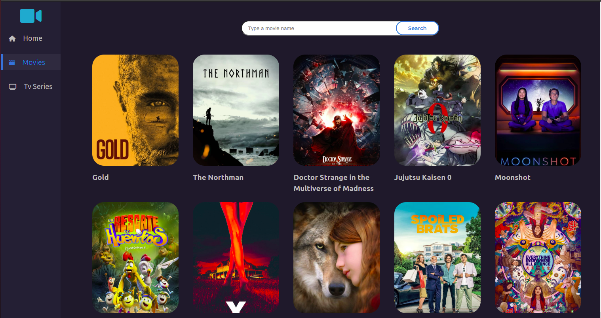

# Move App

## Description

React Movie app is an application that uses the [The Movie Database API](https://developers.themoviedb.org/3/getting-started).
It's a simple app to view Trending, On TV, Top Rated, and Coming Soon Movies. Display each movie with some description about it. And you can search for a move by its name.

[Demo]()




## Table of Contents (Optional)

- [Move App](#move-app)
  - [Description](#description)
  - [Table of Contents (Optional)](#table-of-contents-optional)
  - [Installation](#installation)
  - [Usage](#usage)
  - [Folder Structure](#folder-structure)

## Installation

```bash
git clone
cd movie-app
npm install
```

## Usage

> For Development Run

```bash
npm run dev
```

> For Production Run

```bash
npm run build
```

> Open The Browser as

```
http://localhost:3000/
```

## Folder Structure

```bash
├── src
│   ├── assets
│   ├── api
│   │   ├── apiConfig.js
│   │   ├── axiosClient.js
│   │   └── tmdbApi.js
│   ├── config
│   │   └── CustomRoutes.jsx
│   ├── components
│   │   ├── button
│   │   │   ├── Button.jsx
│   │   │   └── button.scss
│   │   ├── custom-pagination
│   │   │   └── CustomPagination.jsx
│   │   ├── footer
│   │   │   ├── Footer.jsx
│   │   │   └── footer.scss
│   │   ├── hero
│   │   │   ├── Hero.jsx
│   │   │   └── hero.scss
│   │   ├── movie-card
│   │   │   ├── MovieCard.jsx
│   │   │   └── movie-card.scss
│   │   ├── movie-grid
│   │   │   ├── MovieGrid.jsx
│   │   │   └── movie-grid.scss
│   │   ├── movie-list
│   │   │   ├── MovieList.jsx
│   │   │   └── movie-list.scss
│   │   ├── search
│   │   │   ├── Search.jsx
│   │   │   └── search.scss
│   │   └── sidebar
│   │   │   ├── Sidebar.jsx
│   │   │   └── sidebar.scss
│   ├── pages
│   │   ├── detail
│   │   │   └── Detail.jsx
│   │   │   └── CastList.jsx
│   │   │   └── detail.scss
│   │   ├── Catalog.jsx
│   │   └── Home.jsx
│   ├── scss
│   │   ├── _breakpoint.scss
│   │   ├── _global.scss
│   │   ├── _mixin.scss
│   │   ├── _variables.scss
│   │   └── _variables.scss
│   ├── App.jsx
│   ├── main.jsx
│   ├── App.scss
│   └── index.css
├── index.html
├── package.json
├── package-lock.json
├── vite.config.js
└── README.md
```
